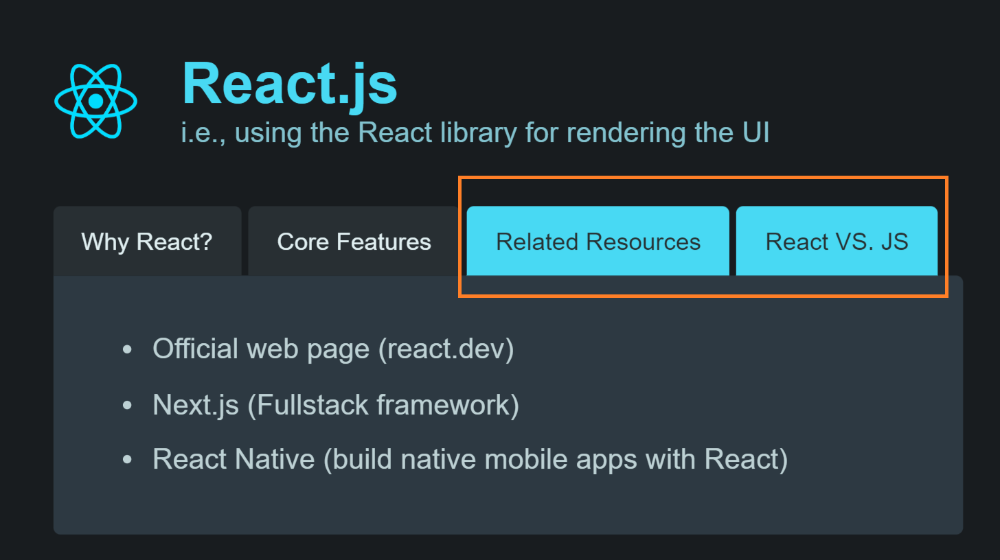
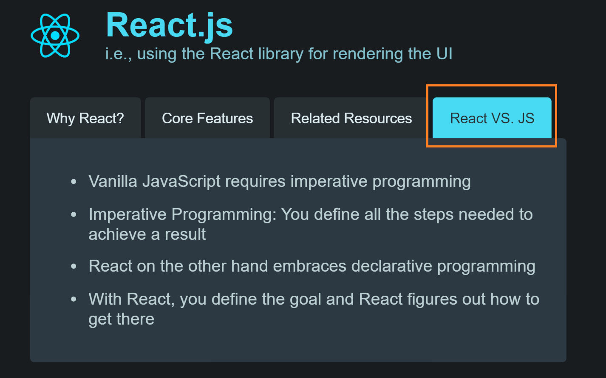

# Editing Our First React App

Now that we understand the differences between declarative programming and imperative programming, we have a better idea of when and why we might want to use React instead of vanilla JavaScript. In this lesson, we'll dive into creating our first React app. Although we haven't started learning about React in-depth yet, we can still create a very basic React app. Let's take a look.

## The task

To accomplish this task, we will be using the same code as the previous lesson, except I have modified the `content` array to have a fourth nested array. Attached [here](https://codesandbox.io/p/sandbox/first-react-app-start-7ec9fd?), you'll find the code sandbox link to the updated starting project.

```js
const content = [
  [
    "React is extremely popular",
    "It makes building complex, interactive UIs a breeze",
    "It's powerful & flexible",
    "It has a very active and versatile ecosystem",
  ],
  [
    "Components, JSX & Props",
    "State",
    "Hooks (e.g., useEffect())",
    "Dynamic rendering",
  ],
  [
    "Official web page (react.dev)",
    "Next.js (Fullstack framework)",
    "React Native (build native mobile apps with React)",
  ],
  [
    "Vanilla JavaScript requires imperative programming",
    "Imperative Programming: You define all the steps needed to achieve a result",
    "React on the other hand embraces declarative programming",
    "With React, you define the goal and React figures out how to get there",
  ],
];
```

Using this updated `content` array, our goal with this task is to add a fourth button which dynamically loads the corresponding content upon being clicked. This task might be challenging but it is encouraged that you try tackling this on your own first. We will, of course, go through this solution together.

## The solution

The first thing to do is to add a fourth button, which we can do by copying the third button.

```jsx
export default function App() {
// ...
        // Third button

          <button
            className={activeContentIndex === 2 ? "active" : ""}
            onClick={() => setActiveContentIndex(2)}
          >
            Related Resources
          </button>
        //  Add a fourth button by copying the third button
          <button
            className={activeContentIndex === 2 ? "active" : ""}
            onClick={() => setActiveContentIndex(2)}
          >
            React VS. JS
          </button>

//   ...
```

Though we got a new button in the UI, the third and the fourth button now become simultaneously active as seen in the image below.



That's because we haven't updated the `activeContentIndex` and the click listener logic, `setActiveContentIndex`. This can be fixed by changing the logic like the following.

```jsx
export default function App() {
// ...
          <button
            className={activeContentIndex === 3 ? "active" : ""}
            onClick={() => setActiveContentIndex(3)}
          >
            React VS. JS
          </button>

//   ...
```

With the code above, we now only see the fourth button being active and its corresponding content when we click on it, which is our desired output.



## Closing Notes

With that simple task done, we have now gotten our hands dirty by writing our first lines of React code. As mentioned previously, if you were not able to do this on your own, that's totally okay because we haven't gotten started on learning React yet, and that is what we will cover next.
